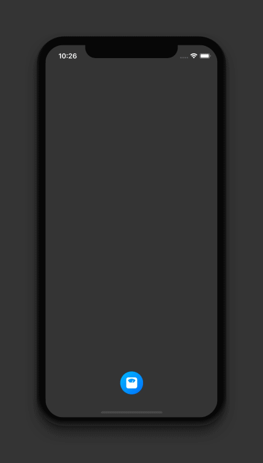

# NumberPicker

[](https://travis-ci.org/Yash Thaker/NumberPicker)
[](https://cocoapods.org/pods/NumberPicker)
[](https://cocoapods.org/pods/NumberPicker)
[](https://cocoapods.org/pods/NumberPicker)




## Installation

NumberPicker is available through [CocoaPods](https://cocoapods.org). To install
it, simply add the following line to your Podfile:

```ruby
pod 'NumberPicker'
```

How to use 
---------
Call this function in action.
```swift
func openNumberPicker() {
let numberPicker = NumberPicker(delegate: self, maxNumber: 300) // set max number 
numberPicker.bgGradients = [.red, .yellow]
numberPicker.tintColor = .white
numberPicker.heading = "Weight"
numberPicker.defaultSelectedNumber = 150 // set default selected number

self.present(numberPicker, animated: true, completion: nil)
}
```
### Customize 
You can change gradient color and tint color and title 
```swift
numberPicker.bgGradients = [.red, .yellow]
numberPicker.tintColor = .white
numberPicker.heading = "Weight"
```
### Delegate 
```swift
extension ViewController: NumberPickerDelegate {

func selectedNumber(_ number: Int) {
print(number)
}
}
```
## Author

Yash Thaker, yashthaker7@gmail.com

## License

NumberPicker is available under the MIT license. See the LICENSE file for more info.
